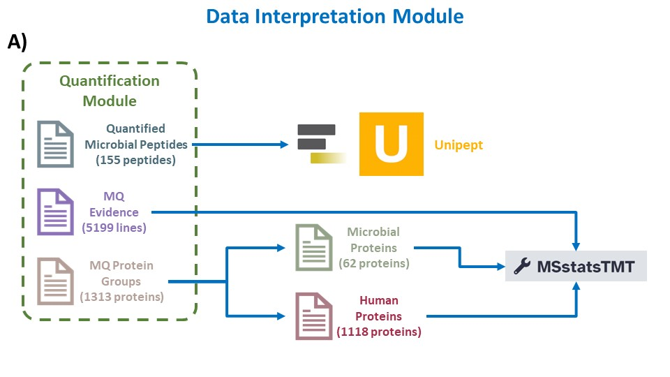

# Introduction

The final workflow in the array of clinical metaproteomics tutorials is the data interpretation workflow. Interpreting MaxQuant data using MSstats involves applying a rigorous statistical framework to glean meaningful insights from quantitative proteomic datasets. The MaxQuant output is explored to understand data distribution and variability. Subsequent normalization helps account for systematic variations. MSstats allows the user to define the experimental design, including sample groups and conditions, to perform statistical analysis. The output provides valuable information about differential protein expression across conditions, estimates of fold changes, and associated p-values, aiding in the identification of biologically significant proteins. Furthermore, MSstats enables quality control and data visualization, ultimately enhancing our ability to draw meaningful conclusions from complex proteomic datasets.


> <agenda-title></agenda-title>
>
> In this tutorial, we will cover:
>
> 1. TOC
> {:toc}
>
{: .agenda}

## Get data

> <hands-on-title> Data Upload </hands-on-title>
>
> 1. Create a new history for this tutorial
> 2. Import the files from [Zenodo]({{ page.zenodo_link }}) or from
>    the shared data library (`GTN - Material` -> `{{ page.topic_name }}`
>     -> `{{ page.title }}`):
>
>    ```
>    
>    ```
>    ***TODO***: *Add the files by the ones on Zenodo here (if not added)*
>
>    ***TODO***: *Remove the useless files (if added)*
>
>    
>
>    
>
> 3. Rename the datasets
> 4. Check that the datatype
>
>    
>
> 5. Add to each database a tag corresponding to ...
>
>    
>
{: .hands_on}


## Sub-step with **Unipept**

> <hands-on-title> Task description </hands-on-title>
>
> 1.  with the following parameters:
>    - *"Unipept application"*: `peptinfo: Tryptic peptides and associated EC and GO terms and lowest common ancestor taxonomy`
>    - *"Peptides input format"*: `tabular`
>        -  *"Tabular Input Containing Peptide column"*: `output` (Input dataset)
>        - *"Select column with peptides"*: `cc1`
>    - *"Match input peptides by"*: `Match to the full input peptide`
>    - *"Choose outputs"*: ``
>
>
{: .hands_on}


## Sub-step with **Select**

> <hands-on-title> Task description </hands-on-title>
>
> 1.  with the following parameters:
>    -  *"Select lines from"*: `output` (Input dataset)
>    - *"that"*: `NOT Matching`
>    - *"the pattern"*: `(HUMAN)|(REV)|(CON)|(con)`
>    - *"Keep header line"*: `Yes`
>
>
{: .hands_on}

## Sub-step with **Select**

> <hands-on-title> Task description </hands-on-title>
>
> 1.  with the following parameters:
>    -  *"Select lines from"*: `output` (Input dataset)
>    - *"the pattern"*: `(HUMAN)`
>    - *"Keep header line"*: `Yes`
>
>
{: .hands_on}


## Sub-step with **MSstatsTMT**

> <hands-on-title> Task description </hands-on-title>
>
> 1.  with the following parameters:
>    - *"Input Source"*: `MaxQuant`
>        -  *"evidence.txt - feature-level data"*: `output` (Input dataset)
>        -  *"proteinGroups.txt"*: `out_file1` (output of **Select** )
>        -  *"annotation.txt"*: `output` (Input dataset)
>    - In *"Plot Output Options"*:
>        - *"Select protein IDs to draw plots"*: `generate all plots for each protein`
>    - *"Compare Groups"*: `Yes`
>        - *"Use comparison matrix?"*: `Yes`
>            -  *"Comparison Matrix"*: `output` (Input dataset)
>        - In *"Comparison Plot Options"*:
>            - *"Select protein IDs to draw plots"*: `generate all plots for each protein`
>            - *"Select comparisons to draw plots"*: `Generate all plots for each comparison`
>
>
{: .hands_on}


## Sub-step with **Select**

> <hands-on-title> Task description </hands-on-title>
>
> 1.  with the following parameters:
>    -  *"Select lines from"*: `out_file1` (output of **Select** )
>    - *"that"*: `NOT Matching`
>    - *"the pattern"*: `(REV)|(con)`
>    - *"Keep header line"*: `Yes`
>
>
{: .hands_on}


## Sub-step with **MSstatsTMT**

> <hands-on-title> Task description </hands-on-title>
>
> 1.  with the following parameters:
>    - *"Input Source"*: `MaxQuant`
>        -  *"evidence.txt - feature-level data"*: `output` (Input dataset)
>        -  *"proteinGroups.txt"*: `out_file1` (output of **Select** )
>        -  *"annotation.txt"*: `output` (Input dataset)
>    - In *"Plot Output Options"*:
>        - *"Select protein IDs to draw plots"*: `generate all plots for each protein`
>    - *"Compare Groups"*: `Yes`
>        - *"Use comparison matrix?"*: `Yes`
>            -  *"Comparison Matrix"*: `output` (Input dataset)
>        - In *"Comparison Plot Options"*:
>            - *"Select protein IDs to draw plots"*: `generate all plots for each protein`
>            - *"Select comparisons to draw plots"*: `Generate all plots for each comparison`
>
>
{: .hands_on}

# Conclusion
With the completion of this tutorial, you have successfully completed the clinical metaproteomics tutorials.
In conclusion, clinical metaproteomics tutorials represent an essential gateway to harnessing the power of advanced proteomic techniques in the realm of clinical research and applications. These bioinformatics tutorials serve as valuable guides for understanding the intricacies of metaproteomic workflows, from  data analysis to interpretation. By providing comprehensive knowledge and practical insights, they equip researchers and clinicians with the tools necessary to explore the rich diversity of the microbiome and its impact on health and disease or environment. As metaproteomic techniques continue to evolve and integrate with clinical practice, we hope these tutorials will be instrumental in shaping the clinical research.
