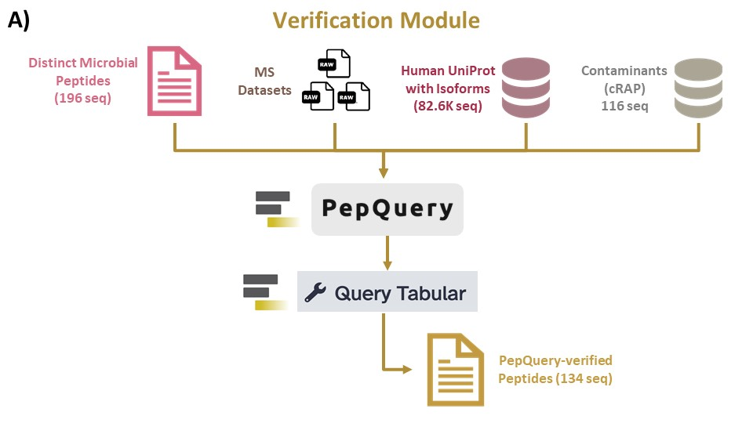
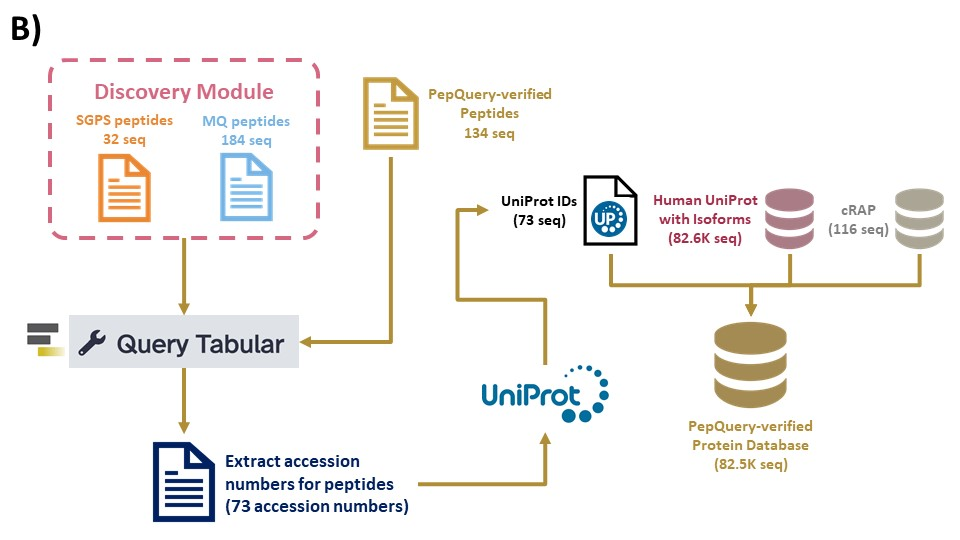

# Introduction

In proteomic research, the primary goal is to obtain accurate and meaningful insights into the proteome of a biological system. Verifying the presence of peptides or proteins is a critical step in achieving this goal, ensuring the quality and reliability of the data and the biological relevance of the findings. This tutorial is a sequel to the clinical metaproteomics discovery workflow. Once you have identified microbial peptides, the next step is to verify these peptides, for which we use PepQuery. 

The PepQuery tool is used to validate the identified microbial peptides from SearchGUI/PeptideShaker and MaxQuant, to ensure that they are indeed of microbial origin and that human peptides were not misassigned. To do this, all confident microbial peptides from the two database search algorithms were merged and searched against the Human UniProt Reference proteome (with Isoforms) and cRAP databases.

Interestingly, the PepQuery tool does not rely on searching peptides against a reference protein sequence database as “traditional” shotgun proteomics does, which enables it to identify novel, disease-specific sequences with sensitivity and specificity in its protein validation.



Then we extract microbial protein sequences that are assigned to the PepQuery verified peptides. To this, we again add the Human UniProt Reference proteome (with Isoforms) and cRAP databases for creating a database for quantitation purposes.



> <agenda-title></agenda-title>
>
> In this tutorial, we will cover:
>
> 1. TOC
> {:toc}
>
{: .agenda}

## Get data

> <hands-on-title> Data Upload </hands-on-title>
>
> 1. Create a new history for this tutorial
> 2. Import the files from [Zenodo]({{ page.zenodo_link }}) or from
>    the shared data library (`GTN - Material` -> `{{ page.topic_name }}`
>     -> `{{ page.title }}`):
>
>    ```
>    
>    ```
>
>    
>
>    
>
> 3. Rename the datasets
> 4. Check that the datatype
>
>    
>
> 5. Add to each database a tag corresponding to ...
>
>    
>
{: .hands_on}

> # Extraction of Microbial Peptides
Now that we have identified microbial peptides from SearchGUI/PeptideShaker and MaxQuant, we need to extract the microbial peptide sequences and group them to obtain a list of distinct microbial peptides. This list of distinct peptides will be used as input for PepQuery2 to verify confident microbial peptides.

>
>
## Sub-step with **Cut**

First, we will use the Cut tool (**cite tool info?**) to select out the peptide and protein columns from the SearchGUI/PeptideShaker and MaxQuant Peptide Reports.

> <hands-on-title> Task description </hands-on-title>
>
> 1.  with the following parameters:
>    - *"Cut columns"*: `c6,c2`
>    -  *"From"*: `output` (Input dataset)
>
>
{: .hands_on}


## Sub-step with **Cut**

> <hands-on-title> Task description </hands-on-title>
>
> 1.  with the following parameters:
>    - *"Cut columns"*: `c1,c35`
>    -  *"From"*: `output` (Input dataset)
>
>
{: .hands_on}


Then, we will remove the header line from each of the Cut outputs in order to concatenate (link) them together more easily, using the Concatenate tool (**cite tool?**).

## Sub-step with **Remove beginning**

> <hands-on-title> Task description </hands-on-title>
>
> 1.  with the following parameters:
>    -  *"from"*: `out_file1` (output of **Cut** )
>
>
{: .hands_on}


## Sub-step with **Remove beginning**

> <hands-on-title> Task description </hands-on-title>
>
> 1.  with the following parameters:
>    -  *"from"*: `out_file1` (output of **Cut** )
>
>
{: .hands_on}


## Sub-step with **Concatenate datasets**

We will now concatenate the peptide and protein datasets from SearchGUI/PeptideShaker and MaxQuant. Later, we will generate a list of confident peptides using PepQuery2. The list of confident peptides will be searched against the concatenated peptide-protein datasets from SearchGUI/PeptideShaker and MaxQuant to generate a list of verified peptides.

> <hands-on-title> Task description </hands-on-title>
>
> 1.  with the following parameters:
>    -  *"Datasets to concatenate"*: `out_file1` (output of **Remove beginning** ), `out_file1` (output of **Remove beginning** )
>
>
{: .hands_on}


## Sub-step with **FASTA Merge Files and Filter Unique Sequences**

We generate and merge Human UniProt (with Isoforms) and contaminants (cRAP) to make an input database for PepQuery2.

> <hands-on-title> Task description </hands-on-title>
>
> 1.  with the following parameters:
>    - *"Run in batch mode?"*: `Merge individual FASTAs (output collection if input is collection)`
>        - In *"Input FASTA File(s)"*:
>            -  *"Insert Input FASTA File(s)"*
>                -  *"FASTA File"*: `Human UniProt+Isoforms FASTA` (output of **Protein Database Downloader** )
>                - -  *"FASTA File"*: `cRAP database` (output of **Protein Database Downloader** )
>
>
{: .hands_on}


## Peptide verification using PepQuery
The PepQuery2 tool will be used to validate the identified microbial peptides from SearchGUI/PeptideShaker and MaxQuant to ensure that they are indeed of microbial origin and that human peptides were not misassigned. We will use the list of Distinct Peptides (from the Discovery Module, **cite**), Human UniProt+Isoforms+cRAP database, and our MGF file collection as inputs for PepQuery2. The outputs we are interested in are the four PSM Rank (txt) files (one for each MGF file).

Interestingly, the PepQuery tool does not rely on searching peptides against a reference protein sequence database as “traditional” shotgun proteomics does, which enables it to identify novel, disease-specific sequences with sensitivity and specificity in its protein validation (**cite tool info**).


> <hands-on-title> Task description </hands-on-title>
>
> 1.  with the following parameters:
>    - *"Validation Task Type"*: `novel peptide/protein validation`
>    - In *"Input Data"*:
>        - *"Input Type"*: `peptide`
>            - *"Peptides?"*: `Peptide list from your history`
>                -  *"Peptide Sequences (.txt)"*: `output` (Input dataset)
>        - *"Protein Reference Database from"*: `history`
>            -  *"Protein Reference Database File"*: `output` (output of **FASTA Merge Files and Filter Unique Sequences** )
>        - *"MS/MS dataset to search"*: ` Spectrum Datasets from history`
>            -  *"Spectrum File"*: `output` (Input dataset collection)
>        - *"Report Spectrum Scan as"*: `spectrum title in MGF`
>    - In *"Modifications"*:
>        - *"Fixed modification(s)"*: ``
>        - *"Variable modification(s)"*: ``
>        - *"Use more stringent criterion for unrestricted modification searching"*: `Yes`
>        - *"Consider amino acid substitution modifications?"*: `Yes`
>    - In *"Digestion"*:
>        - *"Enzyme"*: `Trypsin`
>        - *"Max Missed Cleavages"*: `2`
>    - In *"Mass spectrometer"*:
>        - In *"Tolerance"*:
>            - *"Precursor Tolerance"*: `10`
>            - *"Precursor Unit"*: `ppm`
>            - *"Tolerance"*: `0.6`
>        - In *"PSM"*:
>            - *"Fragmentation Method"*: `CID/HCD`
>            - *"Scoring Method"*: `HyperScore`
>            - *"Minimum Charge"*: `2`
>            - *"Maximum Charge"*: `6`
>
>
{: .hands_on}


## Sub-step with **Collapse Collection**

Remember that PepQuery2 generates a PSM Rank file for each input MGF file, so we will have four PSM Rank files. To make the analysis more efficient, we will collapse these four PSM Rank files into one dataset.


> <hands-on-title> Task description </hands-on-title>
>
> 1.  with the following parameters:
>    -  *"Collection of files to collapse into single dataset"*: `psm_rank_txt` (output of **PepQuery2** )
>    - *"Keep one header line"*: `Yes`
>
>
{: .hands_on}


## Sub-step with **Filter**

Now, we want to filter for confident peptides from PepQuery2.

> <hands-on-title> Task description </hands-on-title>
>
> 1.  with the following parameters:
>    -  *"Filter"*: `output` (output of **Collapse Collection** )
>    - *"With following condition"*: `c20=='Yes'`
>    - *"Number of header lines to skip"*: `1`
>
>
{: .hands_on}


## Sub-step with **Remove beginning**

> <hands-on-title> Task description </hands-on-title>
>
> 1.  with the following parameters:
>    -  *"from"*: `out_file1` (output of **Filter** )
>
>
{: .hands_on}


## Sub-step with **Cut**

> <hands-on-title> Task description </hands-on-title>
>
> 1.  with the following parameters:
>    - *"Cut columns"*: `c1`
>    -  *"From"*: `out_file1` (output of **Remove beginning** )
>
>
{: .hands_on}


## Sub-step with **Query Tabular**

We will use the Query Tabular tool (**cite tool***) to search the PepQuery-verified peptides against the concatenated dataset that contains peptides and proteins from SearchGUI/Peptide and MaxQuant.

> <hands-on-title> Task description </hands-on-title>
>
> 1.  with the following parameters:
>    - In *"Database Table"*:
>        -  *"Insert Database Table"*
>            -  *"Tabular Dataset for Table"*: `out_file1` (output of **Cut** )
>            - In *"Table Options"*:
>                - *"Specify Name for Table"*: `pep`
>                - *"Specify Column Names (comma-separated list)"*: `mpep`
>        -  *"Insert Database Table"*
>            -  *"Tabular Dataset for Table"*: `out_file1` (output of **Concatenate datasets** )
>            - In *"Table Options"*:
>                - *"Specify Name for Table"*: `prot`
>                - *"Specify Column Names (comma-separated list)"*: `pep,prot`
>    - *"SQL Query to generate tabular output"*: `select pep.mpep, prot.prot
FROM pep
INNER JOIN  prot on pep.mpep=prot.pep `
>    - *"include query result column headers"*: `Yes`
>
>
{: .hands_on}

## Sub-step with **Remove beginning**

> <hands-on-title> Task description </hands-on-title>
>
> 1.  with the following parameters:
>    -  *"from"*: `output` (output of **Query Tabular** )
>
>
{: .hands_on}

## Sub-step with **Group**

Using the Group tool, we will be able to select out distinct (unique) peptides and proteins from the Query Tabular tool.

> <hands-on-title> Task description </hands-on-title>
>
> 1.  with the following parameters:
>    -  *"Select data"*: `out_file1` (output of **Remove beginning** )
>    - *"Group by column"*: `c1`
>    - In *"Operation"*:
>        -  *"Insert Operation"*
>            - *"Type"*: `Concatenate Distinct`
>            - *"On column"*: `c2`
>
>
{: .hands_on}


## Sub-step with **Query Tabular**

Again, we will use the Query Tabular tool to retrieve UniProt IDs (accession numbers) for the distinct (grouped) peptides.

> <hands-on-title> Task description </hands-on-title>
>
> 1.  with the following parameters:
>    - In *"Database Table"*:
>        -  *"Insert Database Table"*
>            -  *"Tabular Dataset for Table"*: `out_file1` (output of **Group** )
>            - In *"Filter Dataset Input"*:
>                - In *"Filter Tabular Input Lines"*:
>                    -  *"Insert Filter Tabular Input Lines"*
>                        - *"Filter By"*: `normalize list columns, replicates row for each item in list`
>                            - *"enter column numbers to normalize"*: `2`
>                            - *"List item delimiter in column"*: `;`
>                    -  *"Insert Filter Tabular Input Lines"*
>                        - *"Filter By"*: `regex replace value in column`
>                            - *"enter column number to replace"*: `2`
>                            - *"regex pattern"*: `(tr|sp)[|]`
>                    -  *"Insert Filter Tabular Input Lines"*
>                        - *"Filter By"*: `regex replace value in column`
>                            - *"enter column number to replace"*: `2`
>                            - *"regex pattern"*: `[ ]+`
>                    -  *"Insert Filter Tabular Input Lines"*
>                        - *"Filter By"*: `regex replace value in column`
>                            - *"enter column number to replace"*: `2`
>                            - *"regex pattern"*: `[|].*$`
>            - In *"Table Options"*:
>                - *"Specify Name for Table"*: `t1`
>                - *"Use first line as column names"*: `Yes`
>                - *"Specify Column Names (comma-separated list)"*: `pep,prot`
>    - *"SQL Query to generate tabular output"*: `SELECT distinct(prot) AS Accession 
from t1`
>    - *"include query result column headers"*: `No`
>
>    ***TODO***: *Check parameter descriptions*
>
>    ***TODO***: *Consider adding a comment or tip box*
>
>    > <comment-title> short description </comment-title>
>    >
>    > A comment about the tool or something else. This box can also be in the main text
>    {: .comment}
>
{: .hands_on}


> <question-title></question-title>
>
> 1. What is the accession number of a protein?
>
> > <solution-title></solution-title>
> >
> > 1. An accession number of a protein, also referred to as a protein accession number, is a unique identifier assigned to a specific protein sequence in a protein sequence database. These accession numbers are used to reference and catalog proteins in a standardized and systematic manner
> >
> {: .solution}
>
{: .question}

> <question-title></question-title>
>
> 1. Can there be multiple accession numbers for one peptide or protein?
>
> > <solution-title></solution-title>
> >
> > 1. Yes, it is possible for a single peptide or protein to have multiple accession numbers, particularly when dealing with different protein sequence databases, databases for specific species, or different versions of the same database. That's the reason in our workflow we merge both accession and sequences.
> >
> {: .solution}
>
{: .question}

## Sub-step with **UniProt**

Using the UniProt IDs from Query Tabular, we will be able to generate a FASTA database for our PepQuery-verified peptides.

> <hands-on-title> Task description </hands-on-title>
>
> 1.  with the following parameters:
>    - *"Select"*: `A history dataset with a column containing Uniprot IDs`
>        -  *"Dataset (tab separated) with ID column"*: `output` (Input dataset)
>        - *"Column with ID"*: `c1`
>        - *"Field"*: `Accession`
>    - *"uniprot output format"*: `fasta`
>
>
{: .hands_on}


## Sub-step with **FASTA Merge Files and Filter Unique Sequences**

## Generation of Compact Verified Database with UniProt
Lastly, we will merge the Human UniProt (with isoforms), contaminants (cRAP) and the PepQuery-verified FASTA databases into one Quantitation Database that will be used as input for the Quantitation Module (**add link for Quantitation Module**).

> <hands-on-title> Task description </hands-on-title>
>
> 1.  with the following parameters:
>    - *"Run in batch mode?"*: `Merge individual FASTAs (output collection if input is collection)`
>        - In *"Input FASTA File(s)"*:
>            -  *"Insert Input FASTA File(s)"*
>                -  *"FASTA File"*: `proteome` (output of **UniProt** )
>
>
{: .hands_on}


# Conclusion

A peptide verification workflow is a critical step in proteomic research that enhances data reliability, quantitative accuracy, and biological understanding by confirming the presence and validity of selected peptides. It is a pivotal quality control process that ensures the trustworthiness of proteomic findings and supports downstream investigations. By completing this tutorial, you have not only verified the microbial peptides but also created a database consisting of protein sequences from the PepQuery-verified peptides. This database will be now used for quantitation purposes.
