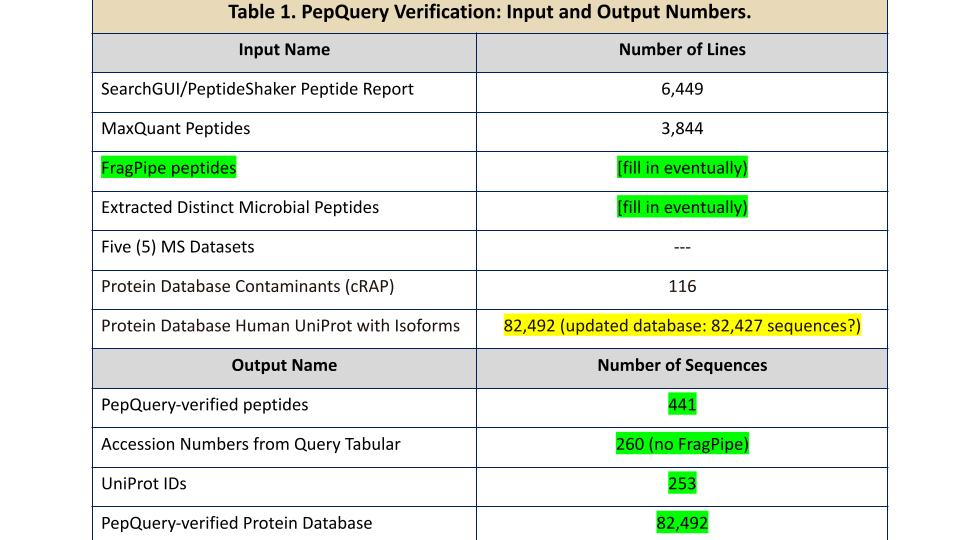

# Introduction
The next step of the clinical metaproteomics workflow is the quantification workflow. Running a quantification workflow in proteomics is essential for several critical purposes. It allows researchers to measure and compare the abundance of proteins or peptides in biological samples, offering valuable insights into biomarker discovery, comparative analysis, and differential expression studies. Quantitative proteomics helps reveal the functional roles of proteins, the stoichiometry of protein complexes, and the effects of drugs on protein expression in pharmacological studies. Additionally, it serves as a quality control measure, validating initial protein identifications, and providing data normalization for increased accuracy. Quantitative data are indispensable for hypothesis testing, systems biology, and their clinical relevance in areas such as disease diagnosis, prognosis, and therapeutic decision-making. In summary, the quantitation workflow in proteomics is a cornerstone for deciphering the complexities of protein expression and regulation, facilitating a wide array of biological and clinical applications. 

In this current workflow, we perform Quantification using the MaxQuant tool and the output will be interpreted in our next module.




> <agenda-title></agenda-title>
>
> In this tutorial, we will cover:
>
> 1. TOC
> {:toc}
>
{: .agenda}


## Get data

> <hands-on-title> Data Upload </hands-on-title>
>
> 1. Create a new history for this tutorial
> 2. Import the files from [Zenodo]({{ page.zenodo_link }}) or from
>    the shared data library (`GTN - Material` -> `{{ page.topic_name }}`
>     -> `{{ page.title }}`):
>
>    ```
>    
>    ```
>    ***TODO***: *Add the files by the ones on Zenodo here (if not added)*
>
>    ***TODO***: *Remove the useless files (if added)*
>
>    
>
>    
>
> 3. Rename the datasets
> 4. Check that the datatype
>
>    
>
> 5. Add to each database a tag corresponding to ...
>
>    
>
{: .hands_on}


# **MaxQuant**

In the Discovery Module (**cite Discovery module**), we used MaxQuant (**cite tool**) to identify peptides for verification. Now, we will again use MaxQuant to further quantify the PepQuery-verified peptides, both microbial and human.

The outputs we are most interested in consist of the MaxQuant Evidence file, MaxQuant Protein Groups, and MaxQuant Peptides. The MaxQuant Peptides file will allow us to group them to generate a list of quantified microbial peptides.

> <hands-on-title> Task description </hands-on-title>
>
> 1.  with the following parameters:
>    - In *"Input Options"*:
>        -  *"FASTA files"*: `Quantitation Database for MaxQuant` (Input dataset)
>    - In *"Search Options"*:
>        -  *"Specify an experimental design template (if needed). For detailed                           instructions see the help text."*: `output` (Input dataset)
>        - *"minimum peptide length"*: `8`
>        - *"Match between runs"*: `Yes`
>        - *"Maximum peptide length for unspecific searches"*: `50`
>    - In *"Protein quantification"*:
>        - *"Use only unmodified peptides"*: `Yes`
>            - *"Modifications used in protein quantification"*: ``
>        - In *"LFQ Options"*:
>            - *"iBAQ (calculates absolute protein abundances by normalizing to copy number and not protein mass)"*: `No`
>    - In *"Parameter Group"*:
>        -  *"Insert Parameter Group"*
>            -  *"Infiles"*: `output` (Input dataset collection)
>            - *"fixed modifications"*: ``
>            - *"variable modifications"*: ``
>            - *"enzyme"*: ``
>            - *"Quantitation Methods"*: `reporter ion MS2`
>                - *"isobaric labeling"*: `TMT11plex`
>                - *"Filter by PIF"*: `Yes`
>    - In *"Output Options"*:
>        - *"Select the desired outputs."*: ``
>
>
{: .hands_on}

***TODO***: *Consider adding a question to test the learners understanding of the previous exercise*

> <question-title></question-title>
>
> 1. Why can we switch back to using RAW files for MaxQuant, instead of using MGF files?
>
> > <solution-title></solution-title>
> >
> > 1. MaxQuant prefers RAW format compared to MGF as it has more information compared to MGF. 
> >
> {: .solution}
>
{: .question}
> <question-title></question-title>
>
> 1. Previously, we used MaxQuant in the Discovery workflow. Why are we using MaxQuant again, instead of Search GUI/PeptideShaker?
>
> > <solution-title></solution-title>
> >
> > 1. We are using MaxQuant for quantification purposes only. SearchGUI Peptide Shaker doesn't have the capability to perform quantification of peptides or proteins. 
> >
> {: .solution}
>
{: .question}

## Sub-step with **Select**

> <hands-on-title> Task description </hands-on-title>
>
> 1.  with the following parameters:
>    -  *"Select lines from"*: `proteinGroups` (output of **MaxQuant** )
>    - *"that"*: `NOT Matching`
>    - *"the pattern"*: `(_HUMAN)|(_REVERSED)|(CON)|(con)`
>
>
{: .hands_on}


## Sub-step with **Select**

> <hands-on-title> Task description </hands-on-title>
>
> 1.  with the following parameters:
>    -  *"Select lines from"*: `peptides` (output of **MaxQuant** )
>    - *"that"*: `NOT Matching`
>    - *"the pattern"*: `(_HUMAN)|(_REVERSED)|(CON)|(con)`
>
{: .hands_on}


## Sub-step with **Cut**

> <hands-on-title> Task description </hands-on-title>
>
> 1.  with the following parameters:
>    - *"Cut columns"*: `c1`
>    -  *"From"*: `out_file1` (output of **Select** )
>
>
{: .hands_on}


## Sub-step with **Cut**

> <hands-on-title> Task description </hands-on-title>
>
> 1.  with the following parameters:
>    - *"Cut columns"*: `c1`
>    -  *"From"*: `out_file1` (output of **Select** )
>
>
{: .hands_on}

## Sub-step with **Group**

> <hands-on-title> Task description </hands-on-title>
>
> 1.  with the following parameters:
>    -  *"Select data"*: `out_file1` (output of **Cut** )
>    - *"Group by column"*: `c1`
>
>
{: .hands_on}


## Sub-step with **Group**

> <hands-on-title> Task description </hands-on-title>
>
> 1.  with the following parameters:
>    -  *"Select data"*: `out_file1` (output of **Cut** )
>    - *"Group by column"*: `c1`
>
>
{: .hands_on}


# Conclusion

In summary, the implementation of a quantitation workflow using MaxQuant represents a significant advancement in quantitative proteomic research. This approach enables precise measurement of protein and peptide abundances, enhancing our ability to unravel the complexities of biological systems. By offering detailed insights into quantitative changes across different experimental conditions, this workflow is instrumental in biomarker discovery, comparative analysis, and understanding differential protein expression. Its capacity to generate accurate data supports a wide spectrum of applications, including disease research, drug development, and systems biology investigations. Furthermore, the MaxQuant-based quantitation workflow ensures data quality, enabling reliable and reproducible results. It serves as a vital step for quality control, allowing researchers to confidently draw meaningful conclusions from proteomic experiments.
